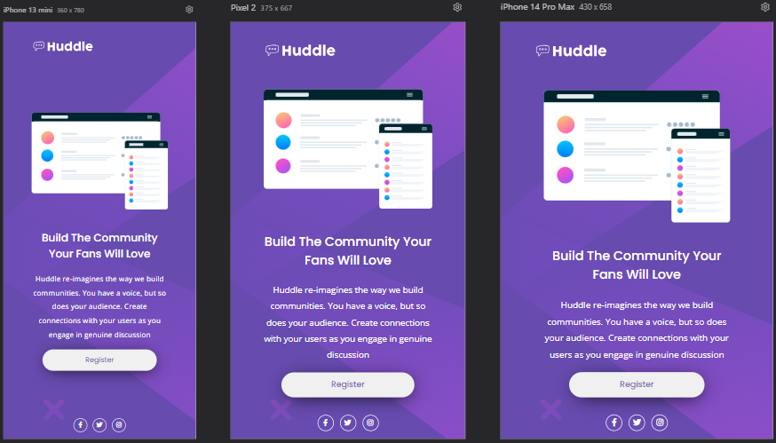
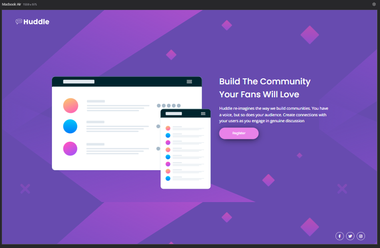

# Frontend Mentor - Huddle landing page with single introductory section solution

Essa é uma solução para o [Huddle landing page with single introductory section challenge on Frontend Mentor](https://www.frontendmentor.io/challenges/huddle-landing-page-with-a-single-introductory-section-B_2Wvxgi0). Frontend Mentor ajuda você a melhorar suas habilidades de codificação construindo projetos realistas.

## Índice

- [Visão geral](#visão-geral)
  - [O desafio](#o-desafio)
  - [Captura de tela](#captura-de-tela)
  - [Links](#links)
- [Meu processo](#meu-processo)
  - [Desenvolvido com](#desenvolvido-com)
  - [O que eu aprendi](#O-que-eu-aprendi)
  - [Desenvolvimento contínuo](#desenvolvimento-continuo)
- [Autor](#autor)

## Visão geral

### O desafio

Usuarios devem ser capaz de:

- Vizualizar o layout ideal, dependendo do tamanho da tela de seu dispositivo.
- Ver estados de foco, para elementos interativos.

### Captura de tela

### Links

- Repository: [https://github.com/ryaansouza/challenge-huddle-landing](https://github.com/ryaansouza/challenge-huddle-landing)
- Deploy: [https://ryaansouza.github.io/challenge-huddle-landing/](https://ryaansouza.github.io/challenge-huddle-landing/)

## Meu Processo

### Desenvolvido com

- HTML5
- CSS
- Flexbox
- Desktop-first workflow

### O que eu aprendi

- Reforcei bastante a manipulação de imagens dentro do site.

### Desenvolvimento Contínuo

Planejo continuar me aventurando em mais desafios, enfrentar novos problemas, e aprender a solucioná-los. Além de descobrir diferentes formas de solucionar problemas que aparecerão durante minha jornada.

## Author

- Linkedin - [Ryan Souza](https://www.linkedin.com/in/ryaansouza/)